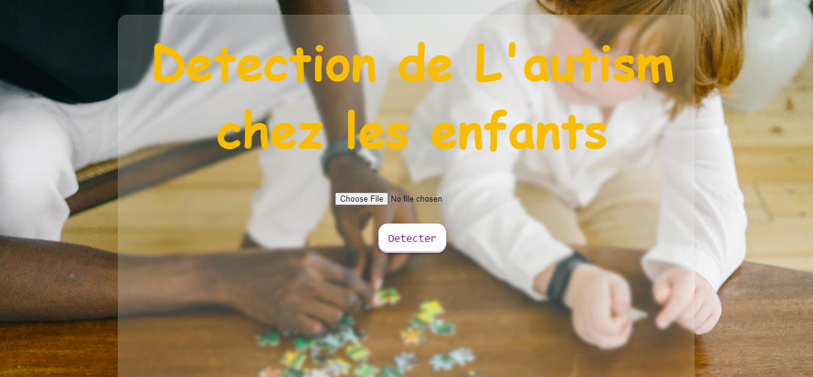
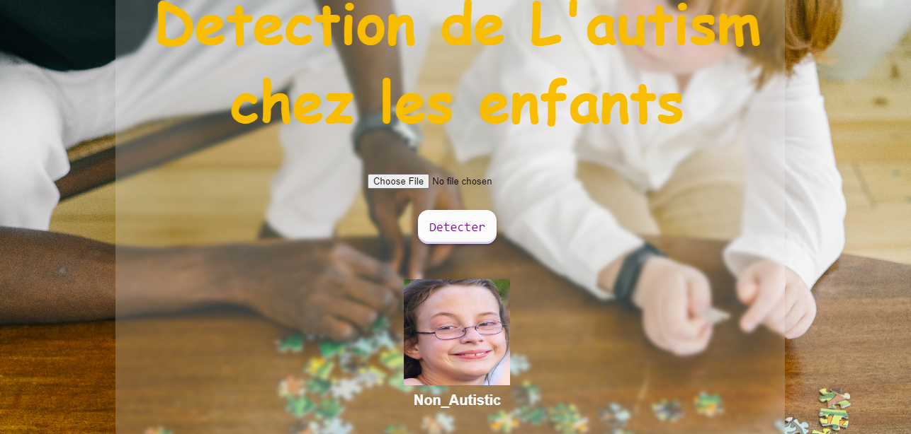

# Autism-Detection-With-CNN
a Django web App to detect Autism using Convolutional Neural Networks on a Database 1327 images for the train and 140 images for the test

## Django

   

Django is a free and open-source, Python-based web framework that follows the model–template–views architectural pattern. It is maintained by the Django Software Foundation, an independent organization established in the US as a 501 non-profit.

## Interfaces

# interface 1 : index   

# interface 2 : Results Page   

